# h1 - Sniff

*26.10.2025*

## Tiivistelmät[^1]

### Wireshark - Getting Started[^2]

- Artikkelissa kerrotaan Wiresharkista, sen asentamisesta Debianille ja miten sitä käytetään.
- Wireshark on työkalu, minkä avulla voi kaapata verkkoliikennettä.
- Kaappauksen voi tallentaa, jonka jälkeen sen sisältöä voi tarkistella ja suodattaa.

### Network Interface Names on Linux[^3]

- Artikkeli sisältää selityksen ja esimerkkejä Debianin käyttämien verkkokorttien nimeämisperusteista.

## Harjoitus

### a) Linux[^1]

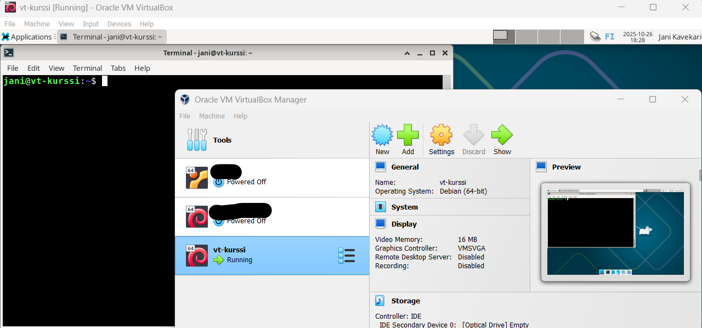

### b) Ei voi kalastaa[^1]

**18:40**: Katsoin ```ip a``` -komennolla virtuaalikoneeni verkkokortit: 

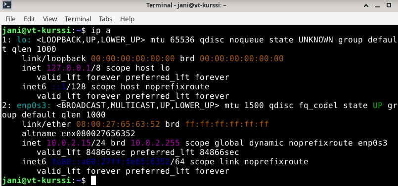

**18:45**: Kokeilin Geeks for Geeksistä[^4] löytämääni ratkaisua yhteyden katkaisemiseen: 

```sudo ip link set enp0s3 down```

Tämän jälkeen kokeilin ping-komennolla yhteyden toimivuutta: 

```ping 1.1.1.1```

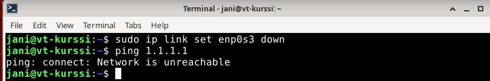

**18:53**: Kokeilin internetyhteyden palauttamista komennolla: 

```sudo ip link set enp0s3 up```

Ja kokeilin uudelleen yhteyttä ping-komennolla: 

```ping 8.8.8.8```

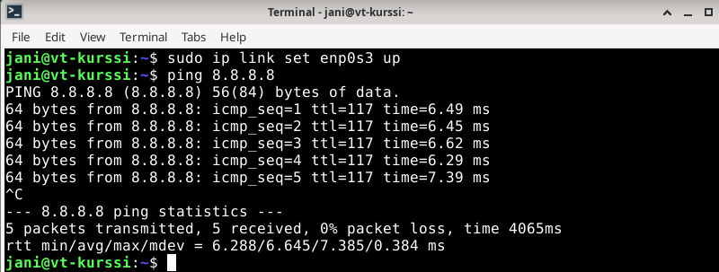

Tämä ratkaisu toimi. 

*Tähän osaan käytetty aika*: **18:40-19:00**

**19:00-19:15**: Tauko

### c) Wireshark[^1]

**19:15**: Asensin Wiresharkin Linuxiini apt-get install -komennolla: 

```sudo apt-get install wireshark``` 

Katselin asennuksen jälkeen lisätietoja Wiresharkista man-komennolla[^5], koska en ole kurssin ensimmäistä tuntia lukuunottamatta sitä ikinä käyttänyt. 

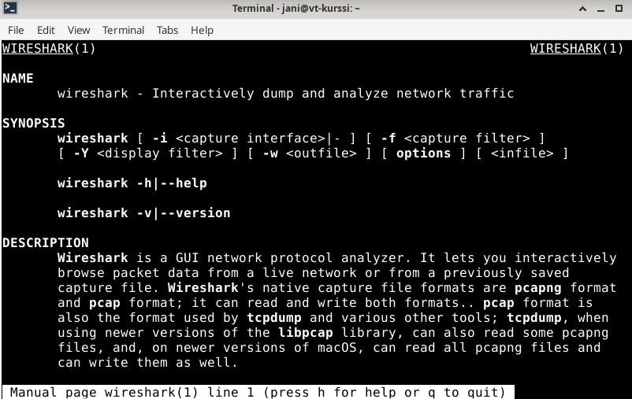

Yritin avata tämän jälkeen wiresharkia peruskomennolla, mutta sain samalla virheilmoituksen: 

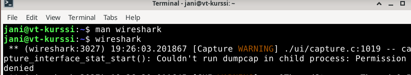

Tämän jälkeen googlailin hieman ratkaisua ongelmaan, kunnes muistin lukea uudelleen Tero Karvisen artikkelin[^2] Wiresharkin käyttöönotosta ja huomasin unohtaneeni olennaisia kohtia asennuksen jälkeen. Lisäsin itseni wireshark-ryhmään adduser-komennolla: 

``` sudo adduser jani wireshark```

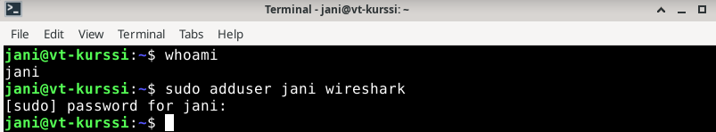

Sitten avasin komentorivin uudelleen ja käytin newgrp -komentoa, jonka jälkeen Wiresharkin avaaminen onnistui odotetusti: 

```newgrp wireshark``` 

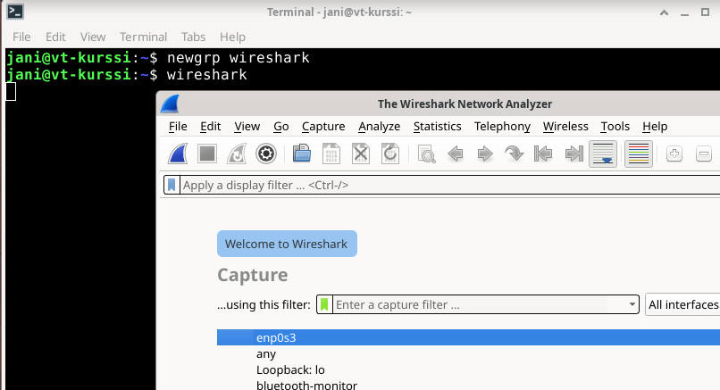

Avattuani Wiresharkin päätin heti kokeilla kaappaamista. Avasin Linuxista Firefoxin kanssa vuokraamani nettiosoitteen ja kaappasin verkkoliikennettä reilun 5 sekunnin verran, jonka jälkeen lopetin. 

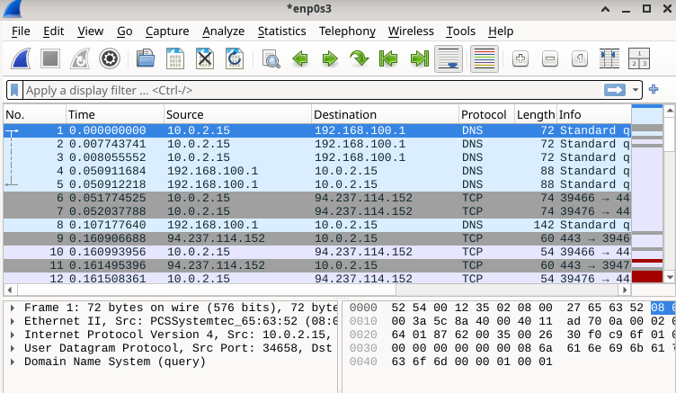

Tämä kohta oli valmis n. **19:55**

*Osioon käytetty aika*: **19:15-19:55**

### d) Oikeesti TCP/IP[^1]

Tein uuden kaappauksen tätä osiota varten ja otin siitä kuvan: 

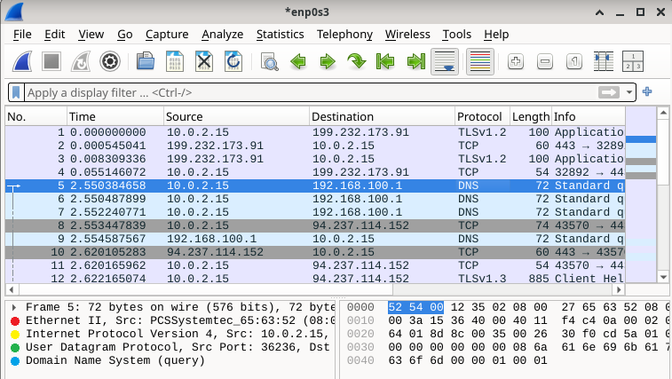 

Käyttöliittymän vasemmassa alakulmassa näkyy TCP-IP-pinon mukaiset kerrokset, joita voi tarkastella: 

- **Linkkikerros**: Ethernet II (Punainen)
- **Internetkerros**: Internet Protocol Version 4 (Keltainen)
- **Kuljetuskerros**: User Datagram Protocol (Vihreä)
- **Sovelluskerros**: Domain Name System (query) (Keltainen)


*Osioon käytetty aika*: **20:00-20:30**

### e) Mitäs tuli surffattua?[^1]

Latasin surfing-secure.pcap -tiedoston ja katselin sitä läpi jokun verran. Katselin tarkemmin Statistics-osion kohtia, mutten ymmärtänyt kovin hyvin yksityiskohtia. IPv4-päätteitä oli 7. Itselleni tuntematon QUIC protokolla tuli heti kaappauksen alussa, lisätietona "Protected Payload". Selvitin Wikipediasta[^6] QUIC:n olevan UDP:n päälle rakennettu protokolla. 

### g) Verkkokortti[^1]

Yritin selvittää verkkokortin merkkiä Ethernet II -kohtaa tutkimalla, mutten löytänyt siitä muuta kuin MAC-numerosarjan. Löin tämän kanssa pitkään päätä seinään, enkä löytänyt edes wiresharkin omaa työkalua[^7] käyttämällä valmistajaa. Googlailu[^8] tarjosi vaihtoehdoksi lähinnä virtuaalikoneiden satunnaisesti annettua numerosarjaa, mikä selittäisi paljon. 

### h) Webbipalvelin[^1]

Yritin tässä kohtaa selvittää web-palvelinta tarkastelemalla TLSv1.3-protokollan paketteja ja TLS-kerroksen antamia tietoja, mutten löytänyt mistään - tai välttämättä vaan ymmärtänyt - tietoa käytetystä web-palvelimesta. 

### i) Analyysi[^1]

Avasin vuokraamani kotisivun ja kaappasin siitä hieman verkkoliikennettä. 

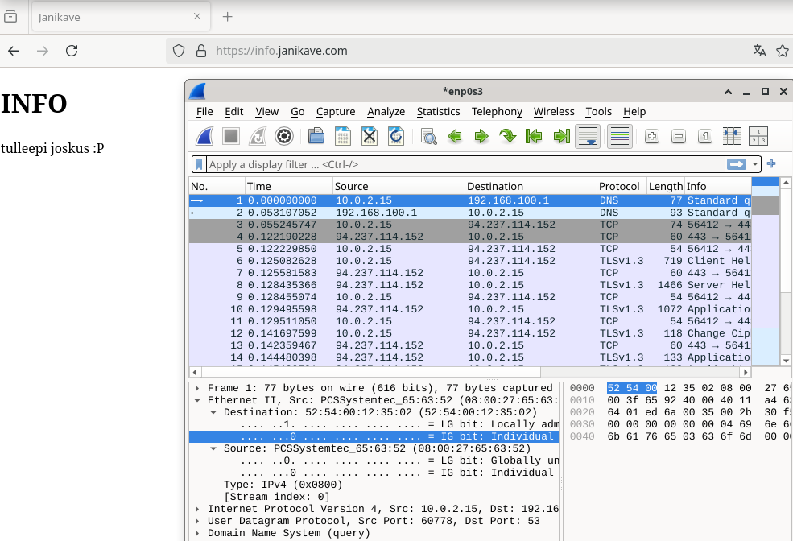

Kaappauksessa näkyy, kun otan yhteyttä palvelimeni nimipalveluun. Tämän jälkeen sivuni suorittaa TLS-kättelyn palvelimen kanssa, jonka jälkeen osoitteeseen pääsee turvallisella yhteydellä. 

**22:40**: Harjoitus oli valmis.

*Viimeisiin osioihin käytetty aika*: **20:40-22:40**

*Harjoitukseen käytetty aika (taukoineen)*: **18:40-22:40**

## Lähteet

Käytin tähän tehtävään ja tiedonhakuun seuraavia lähteitä:

[^1]: Karvinen, Tero: 2025-10-21. h1 Sniff. Tehtävänanto, kurssimateriaali. Luettavissa: https://terokarvinen.com/verkkoon-tunkeutuminen-ja-tiedustelu/#h1-sniff
[^2]: Karvinen, Tero: 2025-03-28. Wireshark - Getting Started. Luettavissa: https://terokarvinen.com/wireshark-getting-started/
[^3]: Karvinen, Tero: 2025-03-28. Network Interface Names on Linux. Luettavissa: https://terokarvinen.com/network-interface-linux/
[^4]: Geeks for Geeks. Disabling and Enabling an Interface on Linux System. Luettavissa: https://www.geeksforgeeks.org/linux-unix/disabling-and-enabling-an-interface-on-linux-system/
[^5]: man wireshark. 
[^6]: Wikipedia: 2025-10-23. Quic - Wikipedia. Luettavissa: https://en.wikipedia.org/wiki/QUIC 
[^7]: Wireshark. OUI Lookup Tool. Luettavissa: https://www.wireshark.org/tools/oui-lookup.html
[^8]: MAC Address Lookup. 52:54:00 - MAC Address Details. Luettavissa: https://maclookup.app/macaddress/525400/mac-address-details
