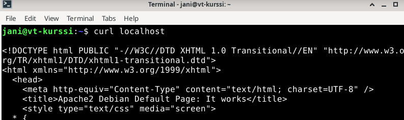
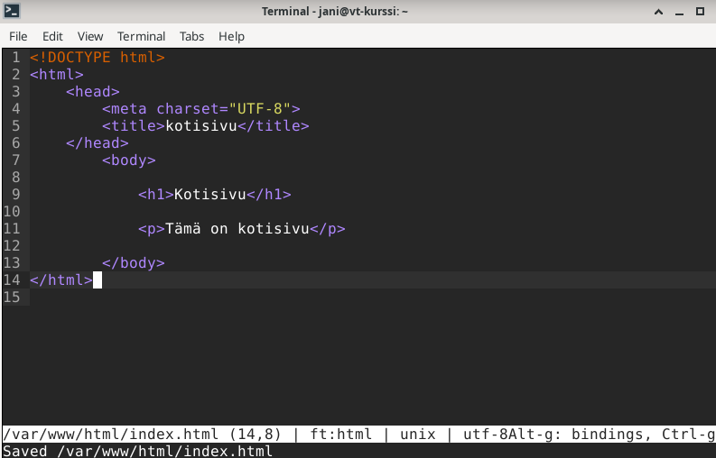
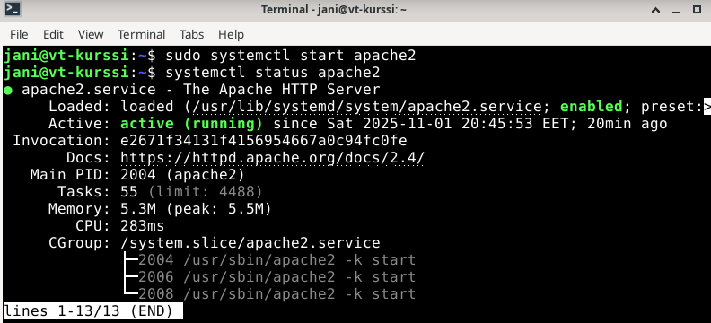
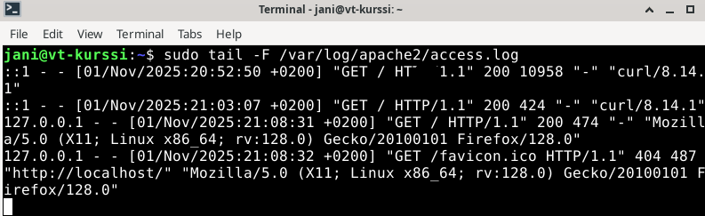

# h2 - Lempiväri: violetti

## x) 

**Tehtävänanto**:  Lue ja vastaa lyhyesti kysymyksiin[^1]: 

- Selitä tuskan pyramidin idea 1-2 virkkeellä.
- Selitä timanttimallin (Diamond Model) idea 1-2 virkkeellä.

### Tuskan pyramidi (Pyramid of Pain)[^2]

Tuskan pyramidin tarkoituksena on visualisoida hyökkääjän hyödyntämiä indikaattoreita tunkeutumista varten sillä periaatteella, että minkä estämisestä tai häirinnästä hyökkääjälle tulee eniten päänvaivaa ja harmia. 
Pyramidin pohjalla (väritykseltään siniset ja vihreät) olevien indikaattorien estäminen tuottavat vähiten vaivaa hyökkääjälle, ja pyramidia ylös noustessa hyökkääjä joutuu käyttämään enemmän aikaa ja resursseja hyökkäykseneston onnistuessa. 

### Timanttimalli (Diamond Model)[^3][^4]

Timanttimalli visualisoi verkkoontunkeutumista neljän pääkomponentin (hyökkääjä, infrastruktuuri, kyvykkyys, uhri) ja niiden välisten suhteiden kautta, mikä auttaa ymmärtämään erilaisia tunkeutumisskenaarioita ja niihin varautumista. 

## Harjoitus 

*1.11.2026*

### a) Apache log[^1]

**20:45**: Asensin Apachen Linuxiini komennolla ```sudo apt-get install apache2```.

Kävin asennuksen jälkeen muokkaamassa Apachen luomaa oletuskotisivua.

```sudo micro /var/www/htmlindex.html``` -> muokkasin micro-editorilla oletustiedostoa.

**Ennen tiedoston muokkausta**



**Tiedoston muokkaus**



**Muokkauksen jälkeen**


**21:05**: Käynnistin Apachen komennolla ```sudo systemctl start apache2```.



Avasin muokkaamani kotisivun Firefox-selaimessa localhost-osoitteessa ja avasin Apachen lokin komennolla: 

```sudo tail -F /var/log/apache2/access.log```

Lokin tallenteissa näkyy sekä aiemmat curl-pyynnöt, että sivun avaaminen selaimen kautta: 



Toiseksi viimeisin lokimerkintä on sivun avaamisesta Firefoxilla. Lokirivi sisältää: 

- ```127.0.0.1```: Pyynnön lähettänyt IP-osoite
- ```[01/Nov/2025:21:08:31 +0200]```: Pyynnön ajankohta (päivämäärä, kellonaika, aikavyöhyke)
- ```"GET / HTTP/1.1"```: Pyynnön tyyppi (GET) ja mitä pyydettiin (HTTP/1.1)
- ```200```: HTTP:n statuskoodi (onnistunut pyyntö)
- ```474```: Palautettavan objektin koko (index.html-tiedosto)
- ```"http://localhost/"```: Sivun URL.
- ```"Mozilla/5.0 (X11; Linux x86_64; rv:128.0) Gecko/20100101 Firefox/128.0"```: Pyynnön lähettäneen palvelimen selaintietoja. 

*Osioon käytetty aika*: **20:45-21:35**

### b) Nmapped[^1]

*2.11.2025*

**18:30**: Avasin Linuxin komentorivin. Katsoin hieman lisätietoja nmap-komennosta tldr-komennolla[^5] ja googlaamalla[^6].

**18:40**: Asensin nmapin komennolla ```sudo apt-get install nmap```. Tämän jälkeen katsoin vielä komennon man-sivua[^7].

**18:47**: Katkaisin virtuaalikoneeni verkkoyhteyden komennolla ```sudo ip link set enp0s3 down```.

Tämän jälkeen ajoin komennon ```sudo nmap -A -p 80 localhost```. Tämän skannauksen tulos: 

KUVA(h2_nmap.png)

Skannauksen tulos sisältää: 

        PORT  STATE  SERVICE  VERSION
        80/tcp  open   http  Apache httpd 2.4.65 ((Debian))
        
- Portin nimi (80/tcp, portin status (open), käytettävä palvelu (http), palvelimen versio (Apache)
- ```|_http-server-header```: Palvelimen palauttama http-header
- ```|_http-title```: Palvelimen palauttamalle html-sivulle annettu nimi (<title>)
- ```Device type```: Nmapin laitteelle määrittelemä käyttötarkoitus (esim. general purpose, router, firewall, phone)
- ```Running```: Nmapin arvio käyttöjärjestelmästä
- ```OS CPE```: Linux kernelin tunniste
- ```OS Detais```: Nmapin arvio käyttöjärjestelmän versiosta
- ```Network Distance```: Kuinka monen reitittimen kautta paketti on kulkenut (0 = sama aliverkko)

**19:35**: Tein uuden porttiskannauksen lisäämällä tehtävänannon[^1] vinkkien mukaisesti -T4 ja -vv vaihtoehdot nmap-komentoon. 

```sudo nmap -T4 -A -vv -p 80 localhost```

KUVA(h2_nmap_vv.png)

Tämän skannauksen tulos sisälsi aiempien yksityiskohtien lisäksi: 

```REASON```: otsake, joka kertoo nmapin saaman vastauksen portin tilasta (syn-ack = portti on auki) 
```| http-methods```: palvelimen sallimat http-metodit
```|_Supported Methods```: näyttää kaikki sallitut http-metodit 
```TCP/IP fingerprint```: TCP-IP pakettien luoma uniikki jälki

**19:50**: Tämä osio oli valmis. 

### c) Skriptit[^1]

Ajaessani ensimmäisen komennon viime kohdassa skannauksen tuloksessa näkyi vain kaksi skriptiä: ```http-server-header``` ja ```http-title```.

Toisen nmap-komennon (sisältäen -T4 ja -vv-vaihtoehdot) tulokseen tuli myös lisäksi ```http-methods```. 

### d) Jäljet lokissa[^1]

**20:00**: Katsoin viimeisimmät lokit komennolla ```sudo tail -f /var/log/apache2/access.log```. 

KUVA(h2_log_nmap.png)

Kuten kuvasta näkyy, porttiskannauksesta jäi jälkiä lokeihin. Lokimerkinnät erottuvat Nmap Scripting Engine-merkinnällä, mutta kyseisissä merkinnöissä oli käytetty vain OPTIONS-metodia. 

Tämän jälkeen hain lisää lokimerkintöjä komennolla ```sudo tail -n +10 /var/log/apache2/access.log```. 

KUVA(h2_log_nmap2.png)

Tämän avulla löysin lisää lokimerkintöjä, joissa NSE-merkityt merkinnät käyttivät myös muita eri metodeja. 

Jos yrittäisin tunnistaa porttiskannauksen jostain muusta lokista, yrittäisin todennäköisesti hyödyntää grep-komentoa ja etsiä avainsanan tai patternin avulla porttiskannaukseen viittaavia merkintöjä. 

**20:20**: Tämä osio oli valmis. 


## Lähteet 

[^1]: Karvinen, Tero: 2025-10-28. h2: Lempiväri: violetti. Luettavissa: https://terokarvinen.com/verkkoon-tunkeutuminen-ja-tiedustelu/#h2-lempivari-violetti
[^2]: Bianco, David: 2014-01-17. The Pyramid of Pain. Luettavissa: https://detect-respond.blogspot.com/2013/03/the-pyramid-of-pain.html
[^3]: Caltagirone, Sergio. The Diamond Model of Intrusion Analysis. Luettavissa: https://www.threatintel.academy/wp-content/uploads/2020/07/diamond-model.pdf
[^4]: Tidmarsh, David: 2023-11-07. Diamond Model of Intrusion Analysis: What, Why, and How to Learn. Luettavissa: https://www.eccouncil.org/cybersecurity-exchange/ethical-hacking/diamond-model-intrusion-analysis/
[^5]: tldr nmap: 2025-11-02.
[^6]: Geeks for Geeks: 2024-07-19. Nmap Command in Linux with Examples. Luettavissa: https://www.geeksforgeeks.org/linux-unix/nmap-command-in-linux-with-examples/
[^7]: man nmap: 2025-11-02.
